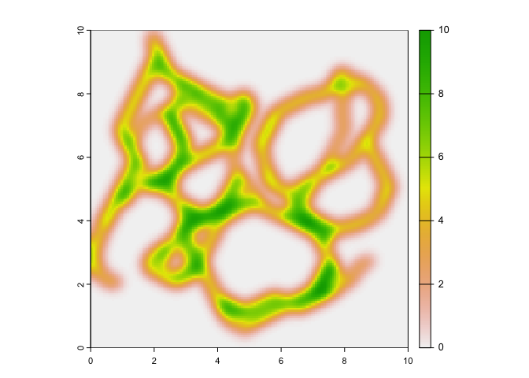
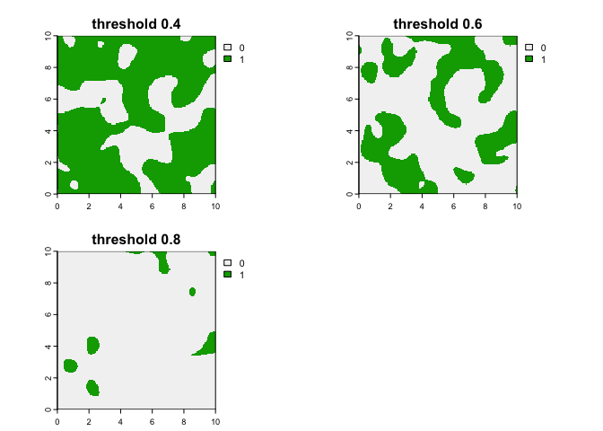
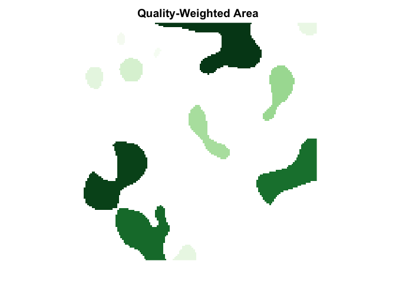

<!-- README.md is generated from README.Rmd. Please edit that file -->

# **habicon**

<!-- badges: start -->

<!-- badges: end -->

The goal of `habicon` is to calculate habitat patch and corridor
priority in terms of their degree of importance to ecological
connectivity. It is designed to integrate a habitat suitability data
(e.g., outputs of species distribution models) and connectivity/corridor
data (e.g., outputs from connectivity models such as CIRCUITSCAPE)

You can install the development version of `habicon` on GitHub with:

``` r
devtools::install_github("ccmothes/habicon")
```

## Example

This is a basic example using simulated habitat suitability and
connectivity maps demonstrating the functions available so far.

**NOTE: This package is still in the early stages of development and
more functions with increased user flexibility are coming soon\!**

``` r
library(habicon)
```

First let’s visualize the simulated raster maps included as example
data.

These include **suit** where values represent habitat suitability and
range from 0-1 (1 being high suitability):

``` r
plot(suit)
```


And second **corr** where values represent conductance to movement and
range from 0-10 (10 being high conductance/ease of movement):

``` r
plot(corr)
```



## Prep Functions

## Standardize input raster values using the `rescale_map` function

As the corridor priority function is currently written, the values of
both maps must range from 0-1. I’ve added a small function that does
this to make the conversion easier for users, so let’s use it to rescale
the connectivity map:

``` r
corr_rescale <- rescale_map(corr)
plot(corr_rescale)
```

 See that the
map still looks the same as before, but now the values range from 0-1.

## Create binary maps to identify individual habitat patches and corridors using the `bin_map` function

Other inputs needed for the priority calculations are binary maps, which
can be created using the `bin_map` function.

Users can test and view binary maps over a range of values:

``` r
suit_bin <- bin_map(suit, threshold = c(0.4, 0.6, 0.8))
plot(suit_bin)
```



Often species distribution models calculate potential threshold values
that users can choose to use. Or, say you want to identify patches of
the highest habitat suitability, say the top 20% of suitability values:

``` r
suit_bin <- bin_map(suit, threshold = quantile(values(suit), 0.8))
plot(suit_bin)
```


For this example, let’s stick with the top 20% of suitability and
conductance values to make the binary maps that identify the individual
habitat patches and corridors.

``` r
corr_bin <- bin_map(corr_rescale, threshold = quantile(values(corr_rescale), 0.8))
plot(corr_bin)
```


## Filter out corridor cells that lie within identified habitat patches with `matrix map`

Since we are only interested in corridors connecting patches and not
those that may overlap with patches, your datasets may vary but you will
likely need to filter out just the corridors that lie within the
intervening matrix. You can create this matrix map with the function
`matrix_map`. The resulting matrix map adds a 1 cell buffer around all
identified matrix corridor cells, as this is necessary for the corridor
priority function to identify all the habitat patches each corridor
connects.

``` r
corr_matrix <- matrix_map(suit_bin = suit_bin, corr_bin = corr_bin)
```

## Calculate corridor priority with the `corr_priority` function

Now using our continuous and binary habitat and corridor surfaces, we
can calculate corridor priority with the `corr_priority` function. NOTE:
This function may take a while, as it performs many calculations on each
individual cell. I am working on speeding up the run time.

``` r
corr_prior <- corr_priority(suit = suit, suit_bin = suit_bin, corr = corr_rescale, corr_bin = corr_matrix)
```

``` r
library(viridis)
plot(corr_prior, col = inferno(n = 100), main = "Corridor Priority")
```


## Calculate patch priority with the `patch_priority` function

`patch_priority` runs much faster than `corr_priority`. This function
essentially ranks each individual patch based on its area and quality
(suitability scores). Higher values indicate better patches. I am
working on improving this calculation to include other metrics such as
the role of each patch in the overall network of patches and corridors
(e.g., centrality index).

``` r
library(scales)
#> 
#> Attaching package: 'scales'
#> The following object is masked from 'package:viridis':
#> 
#>     viridis_pal
patch_prior <- patch_priority(suit = suit, suit_bin = suit_bin)
plot(patch_prior, col = gradient_n_pal(brewer_pal("seq")(9))(seq(0, 1, length=100)), 
     main = "Patch Priority")
```



## Final Product:


### `habicon` is still in the early stages of development, but hopefully this was a good teaser of what is to come. Stay tuned\!
