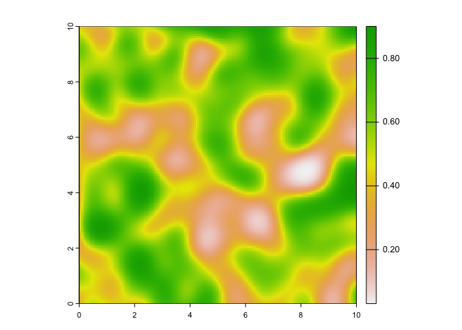
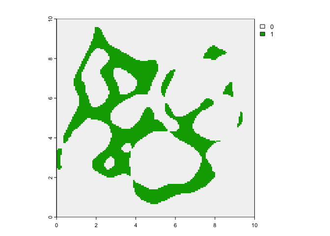

<!-- README.md is generated from README.Rmd. Please edit that file -->

# **habicon**

<!-- badges: start -->

<!-- badges: end -->

The goal of `habicon` is to calculate habitat patch and corridor
priority in terms of their degree of importance to ecological
connectivity. It is designed to integrate habitat suitability data
(e.g., outputs of species distribution models) and connectivity/corridor
data (e.g., outputs from connectivity models such as Circuitscape)

You can install the development version of `habicon` on GitHub with:

    devtools::install_github("ccmothes/habicon")

## Example

This is a basic example using simulated habitat suitability and
connectivity maps demonstrating the functions available so far.

**NOTE: This package is still in the early stages of development and
more functions with increased user flexibility are coming soon\!**

``` r
library(habicon)
```

First let’s visualize the simulated raster maps included as example
data.

These include **suit** where values represent habitat suitability and
range from 0-1 (1 being high suitability):

``` r
plot(suit)
```



And second **corr** where values represent “current” (e.g. Circuitscape
outputs) or similar, where larger values reflect more movement:

``` r
plot(corr)
```


## Prep Functions

## Create binary maps to identify individual habitat patches and corridors using the `bin_map` function

Other inputs needed for the priority calculations are binary maps, which
can be created using the `bin_map` function.

Users can test and view binary maps over a range of values:

``` r
suit_bin <- bin_map(suit, threshold = c(0.4, 0.6, 0.8))
plot(suit_bin)
```


Often species distribution models calculate potential threshold values
that users can choose to use. Or, say you want to identify patches of
the highest habitat suitability, say the top 20% of suitability values:

``` r
suit_bin <- bin_map(suit, threshold = quantile(values(suit), 0.8))
plot(suit_bin)
```


For this example, let’s stick with the top 20% of suitability and
conductance values to make the binary maps that identify the individual
habitat patches and corridors.

``` r
corr_bin <- bin_map(corr, threshold = quantile(values(corr), 0.8))
plot(corr_bin)
```


## Calculate patch priority with the `patch_priority` function

This function ranks individual patches based on multiple connectivity
metrics, including quality-weighted area, weighted betweenness
centrality, and dEC (see Saura et al. 2011). Higher values indicate
higher importance for all metrics. This function returns a raster layer
for each metric, with a connectivity importance value assigned to each
patch. It also returns a sumamry table of all metric scores for each
patch. For this example I kept the default minimum area (removes patches
that are just one pixel) and set the medium dispersal distance (d) to
100. Note that this function takes distances in meters. The minimum area
argument works on vectors of two numbers (since working with pixels), so
if applying your own minimum area you must enter, for example, min\_area
= c(10,10) or min\_area = 2\*res(suit), since ‘res’ returns a vector of
two numbers.

``` r

patch <- patch_priority(suit = suit, suit_bin = suit_bin, corr_bin = corr_bin,
                        resist = resist, d = 100)
```



## Calculate corridor priority with the `corr_priority` function

Now using the same surfaces as in the `patch_priority` function, we can
calculate corridor priority with the `corr_priority` function. This
function identifies and weights possible paths within identified
corridors by mapping all the shortest paths from all possible points of
origin between each pair of connected patches and weights each path
based on the area, quality, and weighted betweenness centrality with a
negative effect of path distance.The final raster output then sums, for
each cell, all path values that cross that cell, so cells with more,
higher valued paths crossing through them are given higher priority.
NOTE: This function may take a while depending on raster size and number
of connected patches. The rasters in this example consist of 22,500
cells and this function finished in a couple minutes.

``` r
corr_prior <- corr_priority(suit = suit, suit_bin = suit_bin, corr = corr_rescale, corr_bin = corr_matrix)
```


